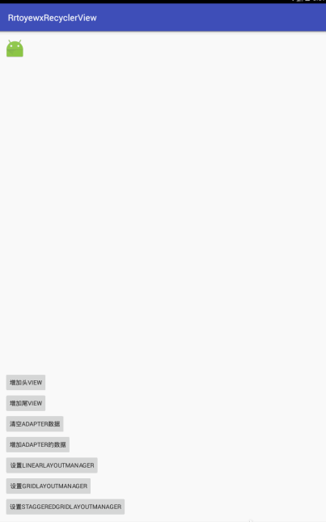
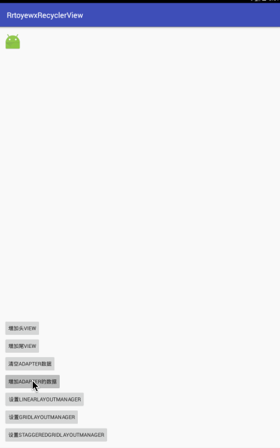
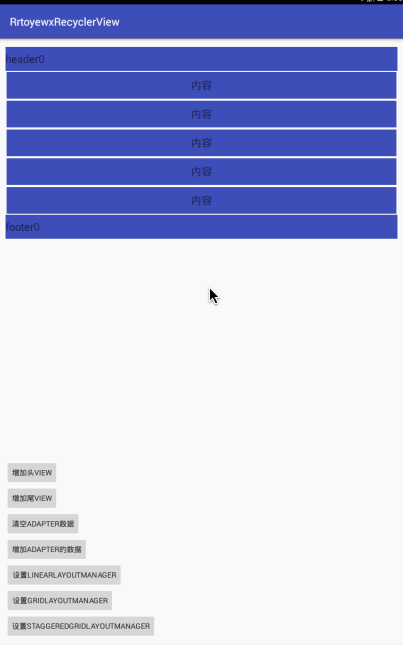

# RrtoyewxRecyclerView

# 更新日志
1. 2016.8.8 17:00 
    完成能够addHeaderView和addFooterView();
2. 2016.8.8 18:50
    - 完成removeHeaderView和removeFooterView();
    - 完成setEmptyView();
    - 修复在设置完LayoutManager后改变LayoutManager，headerView和footerView不占一行的bug;
3. 2016.8.9 18:00
    - 完成加载更多功能
4. 2016.8.9 18:45
    - 修复当页面数据较少的时候，下拉也会出先加载更多view的bug;
5. 2016.8.18 18:42
    - 完成下拉刷新的功能，实现一种最简单的带箭头的下拉刷新;
    - 代码重构第一次;
    - 修复下拉刷新和加载更多手势不对的bug;
    - 下拉刷新和加载更多只能出现一种;
6. 2016.8.19 10:31
    - 完成ImageRefreshHeader;
    - 完成能够切换RefreshHeader;

----
# 目前支持的功能
1. 能够addHeaderView和addFooterView
```

    recyclerView.addHeader(View headerView);
    recyclerView.addFooter(View footerView);
```


效果图：


---
2. 能够setEmpty()
```

    recyclerView.setEmpty(View emptyView);
```

效果图：


------------------------------------------------------
3. 能够显示加载更多
```
    //设置自定义的loadMoreView,可以不设置
    recyclerView.setLoadMoreView(View loadMoreView);
    
   // 开启能够加载更多，必填 默认是false
   recyclerView.setLoadMoreEnable(boolean loadMoreEnable);
   
   //加载更多完成
   completeLoadMore();
   
   //增加加载更多的监听，主要是在回调方法去请求数据等操作，
   addRefreshListener(RefreshListener listener);
```


效果图：


------------------------------------------------------
4. 能够加载更多

```

  //设置下拉刷新功能开启
  recyclerView.setRefreshEnable(true);
  //设置加载的头布局(默认是ArrowRefreshHeader 带箭头的下拉刷新) 所以可以不设置
  recyclerView.setRefreshHeader(BaseRefreshHeader);
  
```
  
  

--------
  
